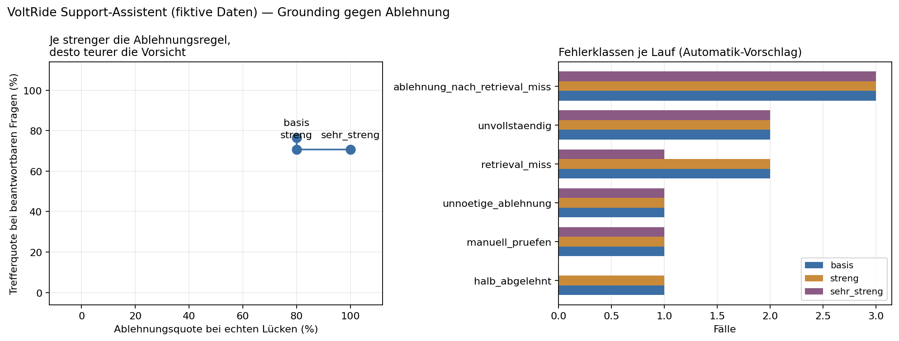

# VoltRide — Support-Assistent über Dokumente (RAG)

Portfolio-Case-Study zu **Grounding und begründeter Verweigerung**: Wann darf ein
RAG-System antworten, wann muss es schweigen, und was kostet jede der beiden
Fehlerrichtungen?

> **Alle Daten sind erfunden.** VoltRide ist ein fiktives Unternehmen, die sechs
> Dokumente und die 25 Eval-Fragen sind synthetisch. Kein Bezug zu einem realen
> Arbeitgeber. Der Vorteil: der Datensatz hat Ground-Truth-Labels, dadurch ist
> Qualität messbar statt behauptet.

**→ [CASE_STUDY.md](CASE_STUDY.md)** — die Auswertung, 3–4 Minuten Lesezeit.

## Ergebnis in drei Zeilen

- Von 13 Fragen, bei denen der Beleg nachweislich im Kontext stand, wurden **12 richtig**
  beantwortet. Jeder echte Fehler entstand eine Stufe davor, beim Suchen.
- Drei unterschiedlich strenge Ablehnungsregeln bewegten die Trefferquote **nicht**.
  Sie ist eine Versicherung gegen Retrieval-Fehler, kein Qualitätshebel.
- Die automatische Bewertung lag bei **4 von 17** Fragen falsch — 24 Prozentpunkte
  Messfehler, verursacht vom Messinstrument.

## Aufbau

| Ordner | Inhalt |
|---|---|
| `notebook/` | `CaseStudy2_RAG_Support.ipynb` — läuft von oben nach unten, 11 Zellen |
| `daten/docs/` | die sechs fiktiven Firmendokumente |
| `daten/eval_fragen_rag.csv` | 25 Fragen mit bekannter Wahrheit |
| `ergebnisse/` | Rohergebnisse der drei Läufe, Kennzahlen, Retrieval-Diagnose, Handcodierung |
| `bilder/` | das Diagramm aus der Case Study |

## Selbst ausführen

1. Notebook in Google Colab öffnen (oder lokal mit Jupyter).
2. Kostenlosen API-Key auf [console.groq.com/keys](https://console.groq.com/keys) holen
   und als Colab-Secret `GROQ_API_KEY` hinterlegen.
3. Die sieben Dateien aus `daten/` hochladen — Ordnerstruktur ist egal, Zelle 2 findet sie.
4. **Zellen 1–5 kosten keinen einzigen API-Aufruf.** Dort steckt die komplette
   Retrieval-Diagnose inklusive Regressionswarnung. Erst Zelle 9 ruft das Modell auf.

Drei komplette Läufe über 25 Fragen kosten rund 0,01 USD. Embeddings laufen lokal.

## Messaufbau

Zwei getrennte Kennzahlen, nie eine gemeinsame:

- **Trefferquote** auf den 17 beantwortbaren Fragen (14 `fakt` + 3 `mehrschritt`)
- **Ablehnungsquote** auf den 5 echten Lücken

Dazu getrennt gemessen der **Beleg-Recall**: stand die belegende Textstelle überhaupt im
gelieferten Kontext? Wenn nicht, ist eine falsche Antwort kein Modellfehler.

Die automatische Bewertung ist ein **Vorschlag**, kein Urteil. Die Spalte `korrekt_manuell`
in `ergebnisse/handcodierung_basis.csv` enthält die Handcodierung, `korrekt_final`
kombiniert beides. Der Cache speichert ausschließlich erfolgreiche Aufrufe —
Fehlschläge im Cache erzeugen still falsche Messwerte.

## Stack

Python · sentence-transformers (`all-MiniLM-L6-v2`, lokal) · Groq `openai/gpt-oss-20b` · pandas · matplotlib
