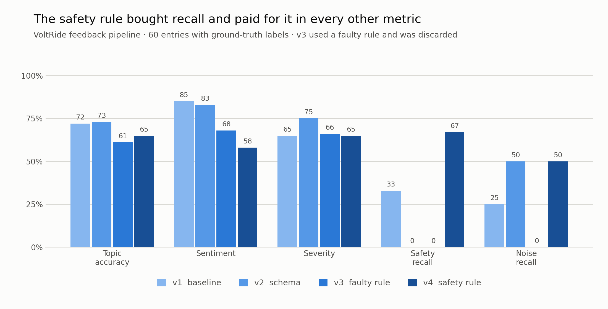
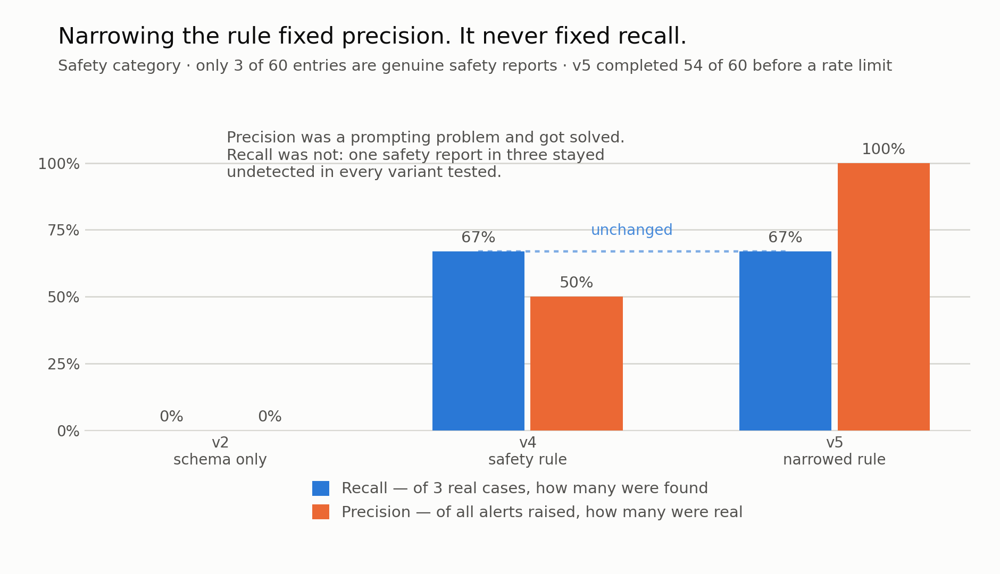

# Turning 2,500 pieces of feedback a month into a prioritized backlog — and why this prototype should not ship

*Why a working prototype still shouldn't go to production — and why the metric that decides it
is not the one on the dashboard.*

I built an LLM pipeline that breaks unstructured user feedback for an e-bike sharing service into
topics, severity levels and feature requests, and turns it into a list ranked by frequency ×
severity. After four measured runs, topic accuracy sits at 73 %.
**That is not good enough to ship — and that is the result of this work.**

`Role: concept, implementation, evaluation` · `Stack: Python, Groq (gpt-oss-20b), sentence-transformers, pandas`
· `Effort: approx. 12 hours`

> **A note on data and language**
> This case study is built on a fictional company and synthetic data. That was a deliberate
> choice: portfolio work has to be public, and my employer's data is not. The upside of a
> purpose-built dataset is that it carries ground-truth labels, which makes quality measurable
> rather than asserted.
>
> The work itself was carried out in German. The feedback corpus deliberately mixes German and
> English, all prompts were written in German, and the category names were English. This write-up
> was translated afterwards. The language mix is part of the design — a European mobility service
> receives feedback in several languages — and one of the findings below only exists because of it.

---

## 1. The problem

VoltRide's product team receives around **2,500 free-text responses per month** from app store
reviews, in-app surveys, support tickets and an email inbox. About 150 of them get read — a
working student samples them and maintains a spreadsheet.

The consequences are concrete. An unlock bug ran for three weeks before it was prioritized.
Safety-relevant reports sit in the same queue as "the app chime is too loud". And nobody can say
how often a topic actually occurs, so prioritization follows volume of complaint rather than
frequency.

## 2. Why this isn't a conventional software problem

The same input can produce different outputs. An acceptance criterion of the form "given input X,
the system returns Y" does not hold here. It has to be replaced by a statistical one: *in at least
N percent of M test cases, the output satisfies criterion Z.*

Second, the cost of errors is heavily asymmetric. A misfiled feature request costs minutes. A
missed brake failure report potentially costs a crash. A single accuracy figure hides exactly that
difference.

## 3. The approach

A dataset of 60 responses — mixed German and English — with ground-truth labels for topic,
sentiment, feature-request flag and severity. Deliberately included: irony, multi-topic entries,
spam, safety-critical reports, ambiguous cases.

One LLM call per entry with an enforced output schema. Every run is measured against the ground
truth and recorded in a log; each run changes **exactly one** thing.

**I ruled out fine-tuning.** Two of my error classes looked like candidates at first. On closer
inspection the model wasn't missing a capability, it was missing a rule — that's a prompt problem,
not a training problem. Fine-tuning changes behavior, not knowledge.

**I also ruled out the smallest model.** `llama-3.1-8b-instant` does not support schema
enforcement. Moving to `gpt-oss-20b` was therefore not an optimization but a precondition — an
architectural constraint that only surfaced during implementation.

## 4. How I measured quality

**Error analysis.** I reviewed all 17 deviations from the baseline run individually, first as
free-form notes (open coding), then grouped into classes (axial coding):

| Error class | n | Cause |
|---|---|---|
| `polite_request_read_as_praise` | 3 | Politely phrased feature requests are read as compliments |
| `noise_not_detected` | 3 | Spam and off-topic entries get filed under a real topic |
| `safety_not_prioritized` | 2 | The hazard is understood but not mapped to the category |
| `irony_taken_literally` | 2 | "Great service" after a complaint is scored as positive |
| `data_issue_read_as_hardware` | 2 | App data errors interpreted as physical defects |
| `keyword_pulls_category` | 2 | A single trigger word drags the classification off course |
| `multi_topic` | 1 | Several topics in one entry, only one captured |
| *`label_disputed`* | 2 | **Not model errors** — my own label was ambiguous |

That 2 of 17 deviations came down to disputed labels is itself a finding. Optimizing a model
against a shaky target definition leads nowhere; in a real project this is where a second
annotator belongs.

**Measurement series.**

| Run | Change | Topic | Sentiment | Severity | **Safety recall** | Noise recall |
|---|---|---|---|---|---|---|
| v1 | Baseline, format described in the prompt only | 72 % | 85 % | 65 % | 33 % | 25 % |
| v2 | Format specification moved from prompt into schema | 73 % | 83 % | 75 % | **0 %** | 50 % |
| v3 | *(faulty rule, see section 5)* | 61 % | 68 % | 66 % | 0 % | 0 % |
| v4 | Safety precedence rule added to the prompt | 65 % | 58 % | 65 % | **67 %** | 50 % |
| v5 | Safety rule narrowed to four named components | *(incomplete run, 54/60)* | | | **67 %** | |

Safety recall is reported separately on purpose. Overall accuracy of 73 % sounds workable — if it
contains two missed brake failure reports, the system is unusable.

**Recall alone is not enough, though.** Measured separately:

| Run | Flagged as safety | Correct | False | Missed | Recall | **Precision** |
|---|---|---|---|---|---|---|
| v2 | 1 | 0 | 1 | 3 | 0 % | 0 % |
| v4 | 4 | 2 | 2 | 1 | 67 % | **50 %** |
| v5 | 2 | 2 | 0 | 1 | 67 % | **100 %** |

v4 buys its recall at the price of one false alarm for every real one. Both false positives are
instructive: *"the QR code on the **handlebar** isn't recognised"* and *"dark mode please, the app
is **blinding at night**"*. Neither describes a safety problem — a component from the rule's list
was merely mentioned. The rule matched vocabulary, not meaning.

v5 narrows the rule to a closed list of four components and explicitly forbids the model from
applying its own judgement of severity. Precision goes to 100 %. The recall does not move: one
safety report in three is still missed, in every variant tested.

*(v5 completed 54 of 60 entries before hitting a rate limit, so its non-safety metrics are not yet
reportable. The safety figures cover all three safety cases and stand.)*

A `success rate` column runs alongside all of this: the share of calls that returned a valid
output at all. Failed calls are **not** counted as predictions — they are excluded and reported.

## 5. What didn't work

**The guardrail didn't hold.** Schema enforcement was supposed to make an invalid category value
impossible. It didn't: the model returned a value outside the enum **reproducibly, in every run**.
It was caught by my own validation layer, not by the provider — despite the documentation
promising "strict". A guardrail you trust without verifying is not a guardrail.

**The safety rule bought recall with collateral damage.** v4 lifted safety recall from 0 to 67 %
while dropping topic accuracy by 8 points, severity by 10, and sentiment by **25**. The model
became over-cautious and classified broadly as safety-relevant — which also explains the sentiment
collapse, since safety cases are almost uniformly negative.

**The output chart was convincing and wrong.** I generated the prioritized chart while the "best
run" variable still pointed at **v3 — the run I had already discarded as faulty**. In that chart
`safety` ranks first with 583 reports a month, a figure produced almost entirely by a broken rule.

Nothing about the chart indicated this. It was correctly formatted, correctly labelled and
internally consistent. The only hint sat in a column I nearly skipped: the average severity of the
`safety` category came out at **1.57**, the second-lowest in the table. A category that is
simultaneously the most frequent and the most harmless contradicts itself — genuine safety cases
sit at 3 to 4.

I caught it by tracing the numbers back to the run that produced them, not by looking at the
picture. To me this is the single most important finding of the work: **a plausible dashboard is
not evidence of quality, and it does not reveal which data it was built from.**

**A silent fallback produced worthless measurements.** Failed calls initially returned a
placeholder that looked like a prediction in the results table — and it was cached on top of that.
It wasn't the accuracy figure that gave it away, which looked plausible, but the **distribution**:
29 of 60 entries classified as "noise" when only 4 are. Since then I check the predicted
distribution against the known one before looking at any metric.

**A category name was itself the bug.** The report "the app's closing chime is far too loud"
landed in the category `noise`. I meant junk data; the model read acoustic noise. Label names are
part of the prompt — the model only sees the word, not the intent. This is the finding that only
exists because prompts were German and category names English.

**An undersized token budget caused silent failures.** With a reasoning model, roughly 70 % of
output tokens go into reasoning. Under the original limit the JSON was cut off mid-response —
visible only as a sporadic 400, not as a pattern.

## 6. Cost and operations

Measured, not estimated: **289 input and 74 output tokens** per entry. At 2,500 responses per month:

| Model | $/month | $/year |
|---|---|---|
| Groq `gpt-oss-20b` | 0.11 | 1.32 |
| Claude Haiku 4.5 | 1.65 | 19.77 |
| Claude Sonnet 5 | 3.29 | 39.54 |

For comparison: manually reviewing 150 entries today costs roughly **€150 per month**. Even the
most expensive model tested comes in at one-fiftieth of that — while processing sixteen times the
volume. Model price is not a decision variable here. Anyone negotiating token prices for this use
case is optimizing the wrong number.

Side finding: schema enforcement reduced average output tokens from 119 to 80. A quality measure
that cut cost by a third.

**The real operational cost lies elsewhere.** Per the support playbook, every safety report
triggers a one-hour first response and an immediate remote lock of the bike.

Extrapolated to 2,500 reports per month, the dataset implies roughly **125 genuine safety reports
a month**. Against that:

- **v4** would raise about 167 alerts, half of them false — around 83 unnecessary one-hour
  responses and 83 bikes pulled out of service for no reason. It would still miss roughly 42
  genuine reports.
- **v5** raises about 83 alerts, none of them false — but misses the same 42.

So the sharper question is not the false alarms, which v5 solves, but the misses, which no prompt
variant solved: **one safety report in three goes undetected regardless of how the rule is
phrased.** For a category whose playbook mandates a one-hour response and a remote lock, that is
the number that decides whether this ships. It is a product decision, not a technical one — and it
can only be discussed with precision and recall side by side, never with a single accuracy figure.

## 7. What I would do differently

**Solve safety outside the model.** Recall stuck at 67 % across every prompt variant, so the next
move is not another prompt. A deterministic component filter — combined with a second pass that
checks whether the mention describes a *fault* rather than just naming a part, which is exactly
where v4's two false positives came from — addresses both failure directions without any side
effect on sentiment and severity. Not every problem in an AI system has to be solved by the model.

**Allow multiple topics.** One label per entry is the wrong data structure — several responses
demonstrably contain two or three separate concerns.

**Grow the dataset.** 60 entries are not enough for theoretical saturation of the error taxonomy,
and with only three safety cases every recall figure is correspondingly coarse. The classes shown
here are sound in direction, not in magnitude.

**Fix the target definition before optimizing the model.** Two disputed labels in 17 deviations is
a signal to sharpen the labeling guideline first.

---

## Conclusion

None of the runs produces a trustworthy backlog. v2 is balanced but misses **every** safety
report. v4 catches two out of three and raises one false alarm per hit. v5 eliminates the false
alarms entirely — and still misses one report in three. That last number did not move across any
prompt variant I tried, which is the clearest signal in the whole exercise: the remaining gap is
not a prompting problem.

The prototype was running after an hour. The remaining time went into schema conflicts, model
limitations, silent fallbacks and misincentives in the prompt — and what stands at the end is a
system I would not put into operation.

That is not a disappointing outcome. It is the actual one. The distance between "the prototype
works" and "I can vouch for the quality" is the stretch where AI projects fail. I now know it from
my own measurements.
