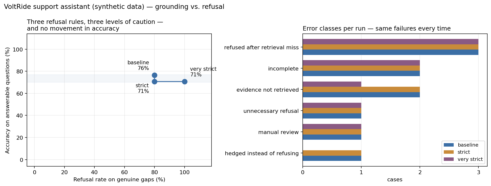

# Case Study 2 — RAG support assistant over internal documents

**Grounding and justified refusal:** when may a retrieval-augmented system answer, when must it
stay silent, and what does each of the two failure directions cost?

> **All data is invented.** VoltRide is a fictional company; the six documents and the 25
> evaluation questions are synthetic. No connection to any real employer. The upside: the
> dataset carries ground-truth labels, which makes quality measurable rather than asserted.
>
> The document corpus is in German, and so are the prompts and the model's answers. That is
> deliberate — English-language retrieval is the easy case, and the central finding below is
> partly a consequence of running an English-trained embedding model on German text. Analysis
> and write-up are in English; file names, column names and raw artefacts are left exactly as
> the runs produced them, so nothing about the results is retouched.

**→ [CASE_STUDY.md](CASE_STUDY.md)** — the write-up, 3–4 minutes.

## The result in three lines

- Of 13 questions where the supporting passage was demonstrably in context, **12 were
  answered correctly**. Every genuine failure happened one step earlier, during retrieval.
- Three increasingly strict refusal rules moved accuracy **not at all**. The refusal rule is
  insurance against retrieval failures, not a quality lever.
- My own automated grader was wrong on **4 of 17** questions — 24 percentage points of
  measurement error, produced by the instrument rather than the system.

## Layout

| Path | Contents |
|---|---|
| `CASE_STUDY.md` | the write-up |
| `notebook.ipynb` | runs top to bottom, 11 cells |
| `../data/docs/` | the six fictional company documents |
| `../data/eval_questions_rag.csv` | 25 evaluation questions with known answers |
| `results/` | raw output of the three runs, metrics, retrieval diagnostics, manual coding |
| `fig_tradeoff_grounding_vs_refusal.png` | the figure used in the write-up |

### Reading the result files

| Column | Meaning |
|---|---|
| `status` | `beantwortet` answered · `unsicher` uncertain · `nicht_im_dokument` refused |
| `antwort` / `quellen` | the answer and the document numbers it cites |
| `top_abschnitte` | which sections retrieval actually delivered |
| `retrieval_any` | was the expected **document** among the top 3? |
| `beleg_im_kontext` | was the supporting **passage** in the context? The honest measure. |
| `korrekt_auto` / `korrekt_manuell` / `korrekt_final` | automated proposal · my manual verdict · the verdict used for the metrics |
| `fehlercode_auto` | proposed error class |
| `label_strittig` | cases where my own reference answer is debatable |

Question types in `eval_fragen_rag.csv`: `fakt` factual · `mehrschritt` multi-hop ·
`luecke` genuine gap, must be refused · `widerspruch` documented contradiction ·
`falle` trap question that sounds answerable but isn't.

## Running it yourself

1. Open the notebook in Google Colab (or locally with Jupyter).
2. Get a free API key at [console.groq.com/keys](https://console.groq.com/keys) and store it
   as the Colab secret `GROQ_API_KEY`.
3. Upload the seven files from `../data/` — folder structure does not matter, cell 2 finds them.
4. **Cells 1–5 make no API calls at all.** They contain the complete retrieval diagnostic,
   including a regression warning that compares against the previous configuration. Only
   cell 9 talks to the model.

Three full runs over 25 questions cost about $0.01. Embeddings run locally and are free.

## How quality is measured

Two metrics, never merged into one:

- **Accuracy** on the 17 answerable questions (14 factual + 3 multi-hop)
- **Refusal rate** on the 5 genuine gaps

Measured separately: **evidence recall** — was the supporting passage present in the retrieved
context at all? If it wasn't, a wrong answer is not a model error. Measuring this at document
level rather than section level flattered the system by 12 percentage points.

The automated grade is a **proposal, not a verdict**. `results/handcodierung_basis.csv` holds the
manual coding; `korrekt_final` combines both. The cache stores successful calls only — cached
failures would silently corrupt the measurements.

## Stack

Python · sentence-transformers (`all-MiniLM-L6-v2`, local) · Groq `openai/gpt-oss-20b` · pandas · matplotlib
